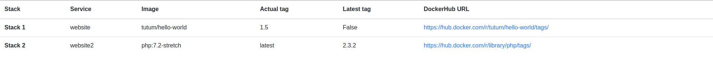

# Search for update in your favorite Rancher server services

This script will get all your services in your given API key's environment and search on [DockerHub](https://hub.docker.com) if an update is available.

## Requirement
* [Python3](https://www.python.org/downloads/)
* pip3
* 'requests' module installed : `pip3 install requests`

## Install
```sh
$ git clone git@github.com:SkYNewZ/python-scripts.git
$ cd python-scripts/rancher-services-check-updates
$ chmod +x main.py
```

## Usage
```bash
usage: main.py [-h] --rancher-url RANCHER_URL --rancher-access-key
               RANCHER_ACCESS_KEY --rancher-secret-key RANCHER_SECRET_KEY
               [--docker-username DOCKER_USERNAME]
               [--docker-password DOCKER_PASSWORD] [--quiet {True,False}]
               [--report REPORT]

optional arguments:
  -h, --help            show this help message and exit
  --rancher-url RANCHER_URL
                        Rancher server url
  --rancher-access-key RANCHER_ACCESS_KEY
                        Rancher API access key
  --rancher-secret-key RANCHER_SECRET_KEY
                        Rancher API secret key
  --docker-username DOCKER_USERNAME
                        Your DockerHub username (mandatory if you have private
                        private registries)
  --docker-password DOCKER_PASSWORD
                        Your DockerHub password (mandatory if you have private
                        private registries)
  --quiet {True,False}, -q {True,False}
                        Don't show result tab in console
  --report REPORT       Generate report as HTML file. Example --report=my-
                        report.html
```

## Report
### Console
This will output an AsciiTable in your console :
```
+---------------+--------------+-------------------------------------+----------------+----------------------------+--------------------------------------------------------------------+
| Stack         | Service      | Image                               | Actual tag     | Latest tag                 | DockerHub                                                          |
+---------------+--------------+-------------------------------------+----------------+----------------------------+--------------------------------------------------------------------+
| Stack 1       | website      | tutum/hello-world                   | 1.5            | False                      | https://hub.docker.com/r/tutum/hello-world/tags/                   |
| Stack 2       | website2     | php:7.2-stretch                     | latest         | 2.3.2                      | https://hub.docker.com/r/library/php/tags/                         |
+---------------+--------------+-------------------------------------+----------------+----------------------------+--------------------------------------------------------------------+

```

### HTML report
Html report will be generated as `report.html`.
It will be auto opened in your favorite browser at the end of the execution

